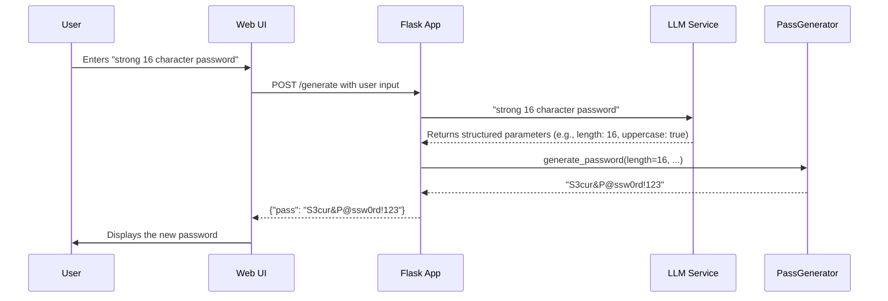

<div style="text-align: center;" align="center">
<a href="https://github.com/mdonmez/passai">

</a>
<br>
<h1>passai</h1>
<p>
AI-powered password and passphrase generator with natural language input.
</p>
</div>


[](https://opensource.org/licenses/MIT)

-----

## Table of Contents

  - [How It Works](#how-it-works)
  - [Key Features](#key-features)
  - [Usage](#usage)
  - [Important Note](#important-note)
  - [Acknowledgements](#acknowledgements)
  - [Contributing](#contributing)
  - [License](#license)

-----

## How It Works

**passai** uses a Large Language Model (LLM) to interpret your natural language requests and generate secure passwords or passphrases tailored to your needs.

1.  **User Input**: You provide a simple description of the password you want (e.g., "a strong 16-character password for a website" or "a memorable 4-word passphrase").
2.  **AI Interpretation**: The backend sends this request to an LLM, which intelligently extracts the parameters needed for generation (length, character types, word count, etc.).
3.  **Secure Generation**: The core `PassGenerator` module uses Python's `secrets` library to create a cryptographically secure password or passphrase based on the AI-defined parameters.
4.  **Result**: The generated pass is sent back to you.



-----

## Key Features

  * **Natural Language Input**: Describe your password needs in plain English.
  * **AI-Powered**: Leverages an LLM to understand requirements and set generation parameters.
  * **Dual Generation Modes**: Creates both secure random passwords and memorable passphrases.
  * **Highly Customizable**: Control length, character types (uppercase, lowercase, numbers, special), and more.
  * **Accessibility Options**: Use `easy_to_read` or `easy_to_type` modes to avoid ambiguous or hard-to-reach characters.
  * **Secure by Design**: Uses Python's `secrets` module for cryptographically strong randomness.
  * **Clean & Simple UI**: A minimalist interface that's fast and easy to use.

-----

## Usage

### Prerequisites

  * Python >=3.12
  * An API Key from an LLM provider supported by [LiteLLM](https://litellm.ai/). This project is pre-configured for Google's Gemini models.


### 1. Running the Project

**1. Clone the repository:**
```bash
git clone https://github.com/mdonmez/passai.git
cd passai
```

**2. Install dependencies with [uv](https://github.com/astral-sh/uv):**
```bash
uv sync
```

**3. Configure your environment:**
Copy the `.env.example` file to a new file named `.env`:
```bash
cp .env.example .env
```
Open the `.env` file and add your LLM MODEL ([LiteLLM](https://docs.litellm.ai/docs/providers)) & LLM API key:
```
LLM_MODEL=your_llm_model_here
API_KEY=your_api_key_here
```

**4. Run the application:**
```bash
uv run -m app
```
The application will be available at `http://127.0.0.1:5000`.

**Demo:**

You can try the live demo at: [https://dub.sh/passai/](https://dub.sh/passai/)

### 2. Example Integration

You can call the `/generate` endpoint from any application.

**Request:**
```bash
curl -X POST http://127.0.0.1:5000/generate \
-H "Content-Type: application/json" \
-d '{"input": "a 12 character password with lots of symbols"}'
```

**Response:**
```json
{
  "pass": "b$!@*#v^E%9g"
}
```

-----

## Important Note

> [!NOTE]
> This is a demo project and should not be used for generating passwords for sensitive accounts without a thorough security review. While it uses secure methods for generation, the interaction with a third-party LLM could have privacy implications. Always use a trusted, local password manager for critical accounts.

-----

## Acknowledgements

This project was made possible by several great open-source libraries:

  * **[Flask](https://flask.palletsprojects.com/)**: For the web framework.
  * **[LiteLLM](https://github.com/BerriAI/litellm)**: For interacting with the language model.
  * **[Instructor](https://github.com/jxnl/instructor)**: For getting structured output from the LLM.
  * **[Pydantic](https://pydantic-docs.helpmanual.io/)**: For data validation.

-----

## Contributing

Contributions are welcome! Please feel free to open an issue or submit a pull request.

-----

## License

This project is licensed under the [MIT License](./LICENSE).
